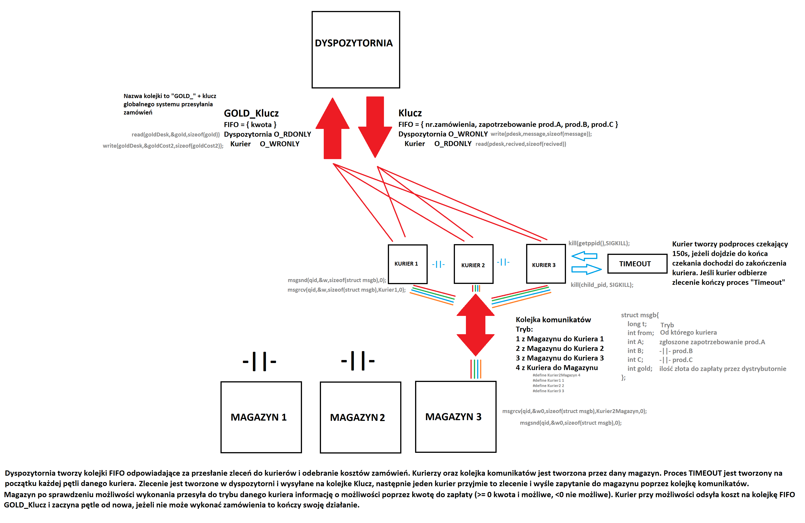

# Projekt zaliczeniowy PSiW

## Opis projektu  

W ramach projektu stworzono system, który **symuluje działanie** dyspozytorni zamówień oraz trzech firm magazynowych.  

### Ogólna koncepcja aplikacji  

1. **Uruchomienie terminali**  
   - Uruchomienie **4 terminali**.  

2. **Uruchomienie aplikacji wieloprocesowych**  
   - W każdym terminalu uruchamiacie odpowiednią aplikację:  
     - **3x magazyn** (każdy magazyn ma **3 kurierów**).  
     - **1x dyspozytornia**.  

3. **Komunikacja między aplikacjami**  
   - Aplikacje komunikują się ze sobą zgodnie z poniższymi regułami.  
   - Po określonym czasie **program kończy działanie**, wypisując finalny stan aplikacji.  

4. **Wypisywanie logów w terminalu**  
   - W terminalu powinny pojawiać się komunikaty informujące o działaniu systemu, np.:  
     ```
     Zlecono zlecenie 14 na 3xA, 2xB, 1xC
     ```
     lub  
     ```
     Zlecenie 14 odebrał kurier 3 magazynu 1
     ```

## Schemat działania  

Poniższy schemat przedstawia w formie graficznej ogólną koncepcję projektu:  



## Dyspozytornia  

- Aplikacja uruchamiana w jednym z **4 terminali**.  
- Co określony czas (np. **co 0,5 sek lub 0,025 sek**) losuje zamówienie i umieszcza je w **kanale komunikacyjnym**.  
- Losowanie można wykonać za pomocą **rand** lub innej biblioteki (należy dodać komentarz w kodzie z informacją o źródle funkcji).  
- Aplikację uruchamiamy poleceniem:  

  ```sh
  ./bin/dystrybutornia <klucz> <liczba_zamówień> <max_A_per_zam.> <max_B_per_zam.> <max_C_per_zam.>
  ```

  np:
  ```
  ./bin/dystrybutornia “kolejka” 1000 5 3 4
  ```

### Parametry
 - `klucz` – klucz globalnego systemu przesyłania zamówień (np. kolejka FIFO, kolejka komunikatów, pamięć współdzielona).
        Każde zamówienie ma postać: <1, 5, 29> (zamówienie na 1x A, 5x B, 29x C).

  -  `liczba zamówień` – liczba losowanych zamówień.

  - `max_X_per_zam` – maksymalna ilość danego surowca na zamówienie.

Wyłączenie dyspozytorni – następuje, gdy wszystkie magazyny zakończą działanie. Po zakończeniu dyspozytornia wypisuje całkowitą wartość GLD zapłaconą za zrealizowane zamówienia.

## Magazyn

- Uruchamiamy 3 procesy magazynowe.
- Każdy magazyn uruchamiamy z plikiem konfiguracyjnym i kluczem:
``` 
./bin/m1 ./config/m1_konf.txt “kolejka”
```

### Plik konfiguracyjny
Zawiera informacje o:
   - Stanach magazynowych surowców (np. 1000xA, 2000xB, 3000xC).
   - Kosztach surowców.

### Działanie
 - Po załadowaniu konfiguracji tworzonych jest 3 kurierów (podprocesy magazynu).
    Kurierzy nasłuchują zamówień z dyspozytorni i tworzą kanał komunikacyjny z magazynem.
    Komunikacja magazyn-kurier może odbywać się za pomocą:
        Potoków
        Kolejek FIFO
        Kolejek komunikatów
        Pamięci współdzielonej

### Proces realizacji zamówienia
 - Kurier pobiera zamówienie z dyspozytorni.
    Wysyła prośbę o zasoby do magazynu.
    Magazyn sprawdza dostępność i informuje kuriera o:
        Możliwości realizacji zamówienia i jego koszcie.
        Braku zasobów (kurier anuluje zamówienie i kończy działanie).
    Jeśli zamówienie jest zrealizowane, kurier przesyła informację do dyspozytorni, która sumuje GLD.
    Magazyn kończy działanie, gdy wszyscy jego kurierzy się wyłączą.

### Warunki zakończenia pracy
 - Kurier wyłącza się, jeśli:
        Nie może zrealizować zamówienia (brak surowców).
        Nie pobrał nowego zlecenia przez 150 sek.
    Magazyn wyłącza się, gdy wszyscy kurierzy się wyłączą.
 - Po zakończeniu magazyn wypisuje stan surowców oraz zarobione GLD.
 - Gra kończy się, gdy wszystkie magazyny się wyłączą, a dyspozytornia wypisze całkowity koszt zamówień (GLD).